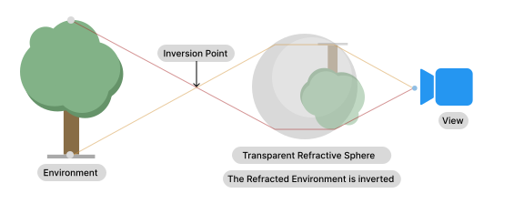
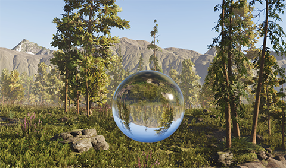
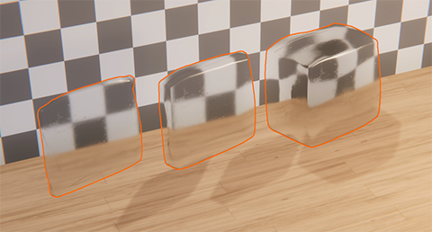

# Refraction models
A refraction model tells HDRP which simple shape most closely matches the internal shape of the object. See [Set the approximate shape of a refractive object](refraction-use.md#set-shape) for more information.

## Sphere refraction model

Use the sphere refraction model if your object is solid with a convex shape. Convex is when the surfaces are not parallel, and bend inward toward the object's center. For example, a round marble.

If you use this model, HDRP does the following [during the refraction process](refraction-concept.md#how-refraction-works-in-hdrp) for each surface pixel:

1. When the light enters the object, HDRP uses the object's surface normal as part of calculating the first refraction. This determines how much the light bends.
2. HDRP uses a sphere to approximate the object's shape, and the diameter of the sphere to determine how far the light travels inside.
3. When the light leaves the object, HDRP uses the sphere's surface normal as part of calculating the second refraction. This determines how much the light bends back.

 
How HDRP calculates the refracted light for three example pixels, if you use a **Refraction Thickness Map** to set different widths for different pixels on an object. The solid orange lines are vectors that represent the direction of light from the camera to a pixel. The white circles represent spheres that approximate the object's thickness. The solid blue lines are surface normals.

To control the diameter of the spheres:

- In a Material's settings, in the [Transparency Inputs](Surface-Type.md#transparency-inputs) section, select a **Refraction Thickness** value or add a **Refraction Thickness Map**
- In Shader Graph, input a value or map into the **Thickness** parameter.

If you use the sphere refraction model with a spherical object, the Scene you see through the object might be upside-down.

 
The light rays bend a lot when they exit the object, so they cross over and hit the opposite end of the tree.

 
The view through a refractive sphere is upside-down.

## Planar refraction model

Use the planar reflection model in the following cases:

- The surfaces of the object are mostly parallel, for example an ice cube.
- The object is hollow, which means the solid walls have parallel surfaces. For example, hollow glass.

You should also use the planar refraction model for a hollow sphere, for example a bubble. 

If you use this model, HDRP does the following [during the refraction process](refraction-concept.md#how-refraction-works-in-hdrp) for each surface pixel:

1. When the light enters the object, HDRP uses the object's surface normal as part of calculating the first refraction. This determines how much the light bends.
2. HDRP uses a parallel plane to approximate the exit surface (this is a 'planar projection'), and the distance between the object's surface and the plane to determine how far the light travels inside.
3. When the light leaves the object, HDRP bends the light back so it has the same direction as the light that entered the object.

 
How HDRP calculates the refracted light for three example pixels, if you use a **Refraction Thickness Map** to set different widths for different pixels on an object. The solid orange lines are vectors that represent the direction of light from the camera to a pixel. The dotted blue lines represent parallel planes approximating the object's thickness. The solid blue lines are surface normals.

To control the distance between the planes:

- In a Material's settings, in the [Transparency Inputs](Surface-Type.md#transparency-inputs) section, select a **Refraction Thickness** value or add a **Refraction Thickness Map**.
- In Shader Graph, input a value or map into the **Thickness** parameter.

Set the thickness to the approximate width of the object. The bigger the width, the more visible the refraction effect.

 
With a thicker object, the light is offset by a greater amount.

 
Objects with increasing thickness, showing how the light is increasingly deformed.

## Thin refraction model

The thin refraction model is the same as the planar refraction model, but HDRP fixes the **Refraction Thickness** at 5mm. You can't override the thickness value.

You should use the thin refraction model with thin objects if you use the [Path Tracing Volume Override](Ray-Tracing-Path-Tracing.md), because it should give better performance.

